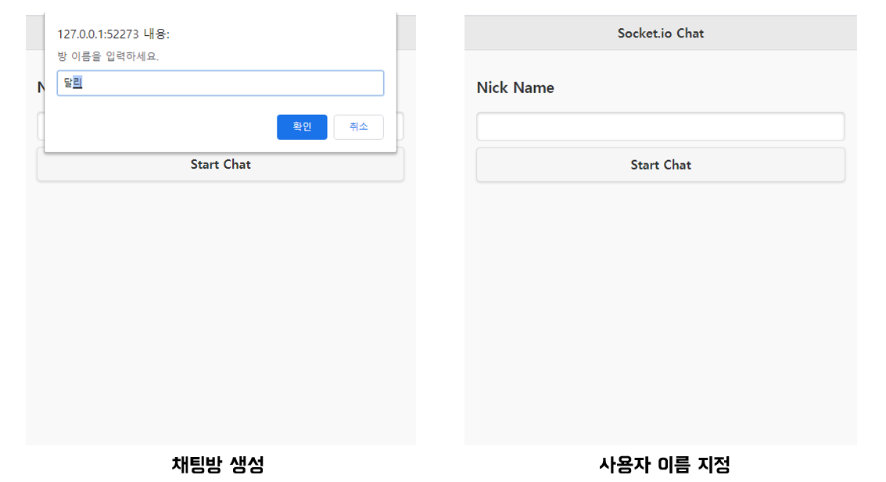
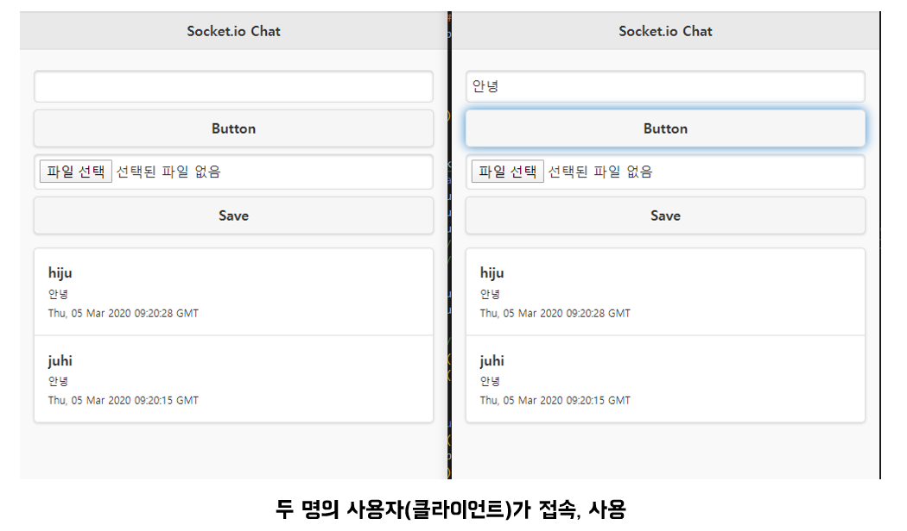
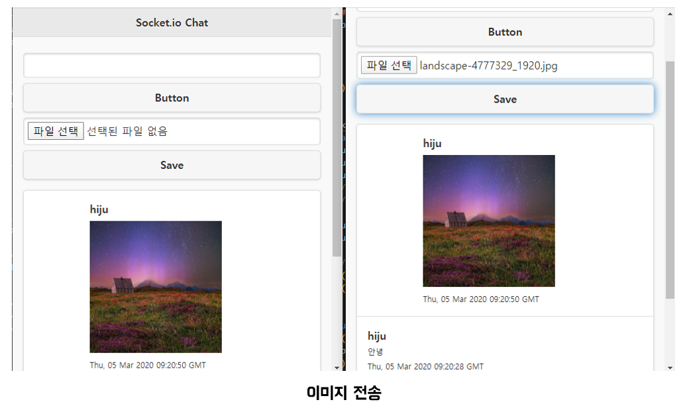

# nodejs-chatting

[출처 - 설명 포스팅1 ](https://juhi.tistory.com/8)

[출처 - 설명 포스팅2 ](https://juhi.tistory.com/9)

---

## Project Introduce

Node.js의 socket.io모듈을 이용하여 채팅 기능을 구현함

-   채팅방 생성
-   그룹, 일대일 채팅 기능
-   사진 전송





## Dependency Module

```
"dependencies": {
    "aws-sdk": "^2.1230.0",
    "express": "^4.18.1",
    "multer": "^1.4.5-lts.1",
    "multer-s3": "^2.10.0",
    "mysql2": "^2.3.3",
    "sequelize": "^6.24.0",
    "socket.io": "^4.5.2"
},
```
